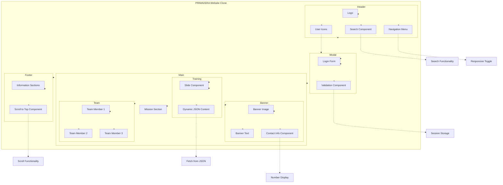

# PRIMAVERA BSS Corporate Website Clone

## Project Summary
A responsive, feature-rich web application implementing modern front-end development practices and interactive user interface elements. This project is a faithful clone of the PRIMAVERA Business Software Solutions corporate website, demonstrating advanced front-end techniques for creating dynamic, user-friendly interfaces.

## Key Technical Highlights

### Front-End Technologies
- HTML5 Semantic Structure
- Advanced CSS3/SCSS
- Modern JavaScript (ES6+)
- Responsive Web Design
- Mobile-First Approach
- Progressive Enhancement

### Advanced CSS Features
- Flexbox and CSS Grid layouts
- CSS Animations and Transitions
- Media Queries for responsiveness
- Custom Properties (CSS Variables)
- BEM Methodology
- CSS Transforms

### JavaScript Implementation
- Async/Await for API calls
- DOM Manipulation
- Event Handling
- Session Storage
- JSON Data Integration
- Form Validation
- Animation Controls

### UI/UX Features
- Responsive Navigation
- Dynamic Content Loading
- Interactive Sliders
- Modal Windows
- Form Validation
- Search Functionality
- Smooth Scrolling
- User Authentication

## Component Structure Diagram


## Project Structure
```
primavera-bss-clone/
├── css/
│   └── index.css
├── javascript/
│   └── index.js
├── html/
│   └── index.html
├── img/
│   ├── banner/
│   ├── logos/
│   ├── team/
│   └── slider/
├── fonts/
│   └── fontawesome/
└── Data/
    ├── Paragraphs.json
    └── Users.json
```

## Key Components

### Dynamic Header
- Responsive navigation menu
- Interactive search functionality
- User authentication system
- Mobile toggle menu

### Banner Section
- Full-width hero image
- Overlaid text with call-to-action
- Responsive layout for all device sizes
- Contact information hover effect

### Mission Section
- Grid-based layout
- Responsive text presentation
- Link to institutional brochure

### Team Section
- Interactive team member cards
- Hover effects revealing member roles
- Responsive grid layout
- Dynamic image transformations

### Training Slider
- Auto-rotating content slides
- Dynamic content loaded from JSON
- Custom animations and transitions
- Responsive on all devices

### Footer Section
- Comprehensive site map
- Organized category sections
- Responsive grid layout
- Back-to-top functionality

### Authentication System
- Modal login window
- Form validation
- User authentication against JSON data
- Session management
- Welcome message for logged-in users

## Responsive Design
The application implements a comprehensive responsive design strategy:

### Desktop (>1100px)
- Full navigation display
- Complete feature set
- 5-column footer

### Tablet (800px-1100px)
- Adjusted navigation
- Hidden banner computer image
- 3-column footer layout

### Mobile (<800px)
- Hamburger menu navigation
- Stacked grid layouts
- Simplified content presentation
- 2-column footer
- Optimized text sizing

## Technical Implementation

### CSS Architecture
- Modular CSS organization
- Strategic use of CSS Grid and Flexbox
- Media queries for breakpoints at 1100px, 940px, 800px, and 650px
- Element transitions and animations
- Custom positioning for modal elements

### JavaScript Functionality
- DOM content loading events
- Dynamic content fetching from JSON
- Modal window management
- Form validation with regex
- User session management
- Smooth scrolling implementation
- Responsive search interaction
- Animation and transition controls

## Authentication
The system includes a fully functional authentication system:

### User Login
- Email and password validation
- Error message display
- Account status verification
- Session storage management

### Session Management
- User session maintained in browser storage
- Visual indicators for logged-in state
- Secure logout functionality

## Installation and Setup

1. Clone the repository
   ```bash
   git clone https://github.com/yourusername/primavera-bss-clone.git
   ```

2. Navigate to the project directory
   ```bash
   cd primavera-bss-clone
   ```

3. Open with a live server or directly open `index.html` in a browser
   ```bash
   # If you have VS Code Live Server extension
   live-server
   ```

## Browser Compatibility
- Chrome (latest)
- Firefox (latest)
- Safari (latest)
- Edge (latest)
- Responsive on mobile browsers

## Future Enhancements
- Form submission functionality
- Additional page implementations
- Enhanced accessibility features
- Performance optimizations
- Backend integration

## License
Copyright (c) 2024 Claudia Souza
All rights reserved.

## Contact
Claudia Souza
Project Link: [https://github.com/yourusername/primavera-bss-clone](https://github.com/yourusername/primavera-bss-clone)
